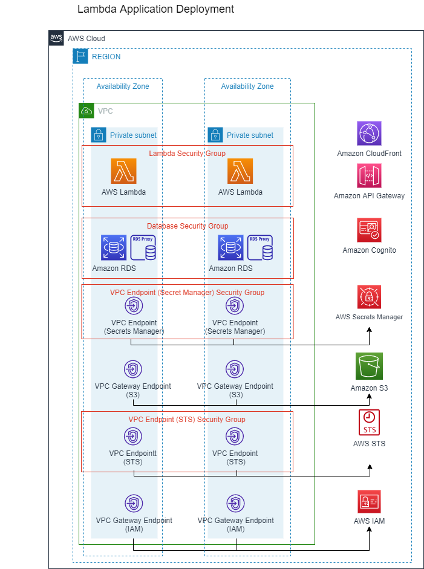

# Migrate and Access BLOB Data Using Amazon S3 From RDBMS APG Example


Migrate BLOB Data From RDBMS APG to Amazon S3 APG Example

[[_TOC_]]


## Overview
Relational Database Management System (RDBMS) supports the binary large object (BLOB). Many customers stores the binary data in the relational database. However, there are challenges with this approach :

1. Database size increase causes performance to decrease.

2. Application Server requires high throughput to handle large object transfers between the client and database which results in poor performance.

3. Queries need to be designed to handle BLOB. For example, if an average object size is 1 MB , query result with 10 rows with all columns would be greater than 10 MB, but if only non-binary columns are selected, the result would be few KB.

4. With Maximum blob size limit in some databases, binary are split into the chunks, adding the complexity to retrieve and store the data . For example, MySQL BLOB column size is about 65 KB. One way to avoid it is to always use biggest data type, but it may not be ideal from database management perspective.

5. Additional design is required to avoid data duplication.

6. Requires High bandwidth network to serve these BLOB results. For example, with record size 1 MB BLOB and 100 concurrent users with each user retrieves 10 record at a time. This will require network bandwidth with 1 GB (100 users x 10 records x 1MB each record => 1000 MB => 1 GB) of data and equivalent computing. In comparison for non blob results would be (100 users x 10 records x 10 KB each record => 10000 KB => 10 MB).

Customers look for alternative approach to keep the record linkage (text record with binary relation) with security integration but being scalable and cheaper. [Amazon S3](https://aws.amazon.com/s3/) is an ideal choice.

Customers are looking for an alternative approach to keep the record linkage (text record with binary relation) with security integration that is scalable and more cost effective. [Amazon Simple Storage Service (Amazon S3)](https://aws.amazon.com/s3/) is an ideal choice, that can stream the data directly to the customers, while keeping the database size to minimum. However there are challenges with this approach such as:

1. How to serve data from old services (with RDBMS) and new services (with S3) to keep business running during large data migration phase?
2. How to leverage existing customer authorization process for S3 object access? General recommendation for S3 access control is through [federation](https://docs.aws.amazon.com/IAM/latest/UserGuide/reference_policies_examples_s3_federated-home-directory-console.html). However, customers have complex authorization requirements :

a. A user may retrieve different number of combinations of binaries, base on user entitlements.
b. There are large number of users (i.e. 10,000+).
c. The role combination exceeds the maximum IAM role allows per account even after [quota increased](https://docs.aws.amazon.com/IAM/latest/UserGuide/reference_iam-quotas.html).
d. It is difficult to re-engineer already existing authorization process into small set of IAM roles.

This pattern provide a solution to migrate BLOB data from RDMS to Amazon S3 and addressing the challenges mentioned earlier.

## Source Architecture 


Please note, the legacy architecture is for demoing purpose only for one type of RDBMS BLOB workload. It may not be the best optimized RDBMS BLOB approach (i.e. the sample mix the data field along with BLOB field).

1. User logins through WebApp UI. 
2. User uses WebApp UI to trigger backend API to retrieve resources contain binary.
3. [Amazon API Gateway](https://aws.amazon.com/api-gateway/) uses integrated Amazon Cognito Authorizer to verify the token in the header with Identity Provider and pass back IAM policy if token is valid.
4. On correct IAM policy, API Gateway forward request to correct Lambda according to configuration
5. Backend ([AWS Lambda](https://aws.amazon.com/lambda/)) checks the record from database and decode BLOB as part of data retrieving
6. Backend passes the binary within response
7. WebApp UI uses the responded binary as download link or image

For upload, a similar process is taken, instead of downloading binary, will upload binary to the API endpoint. The backend will then encode the binary into BLOB as part of data saving

For deletion, the backend will delete the row entry contain the BLOB.

## Target Architecture 

### Binary Download Walkthrough


1. User logins through WebApp UI. 
2. User triggers an action in frontend, which triggers backend API to retrieve resources contain blob.
3. Amazon API Gateway uses integrated Amazon Cognito Authorizer to verify the token in the header with Identity Provider and it passes back IAM policy if token is valid.
4. On correct IAM policy, API Gateway forwards the request to backend according to configuration.
5. Backend (Lambda) checks the record (from database) and its associated S3 resources.
5.1. The S3 prefix from database record will be used to build out the temporary IAM policy like below:
```
[{"Sid":"Stmt1",
"Effect":"Allow",
"Action":"s3:///webblob/id1/blobdb1",
"Resource":["s3:GetObject",
"s3:GetObjectVersion"}]
```
6. The backend combines the generated policy with the pre-generated role `template_s3_role` as a request to AWS STS.
7. AWS STS validates the request is coming from Lambda role with valid IAM role, processed the STS request
8. STS Service returns temporary credentials to backend
9. Backend assembles the credential along with final payload (i.e. database record, S3 prefixes, regions)
Sample
```
{
  "sts": {<temp credential from sts>},
  "region": <backend computing's region>,
  "bucket": <blob's bucket name>,
  "prefixes ": [comma separated list of prefixes ],
  <other data from record>
}
```
10. WebApp UI uses AWS SDK with the received STS credentials to get the S3 presigned URL from S3
11. S3 validates the temporary credential as part of presigned URL
12. Web UI downloads the binary
This sample uses S3 presigned URLs with HTML `<image>` tag to demo image and HTML `<a href>` tag to demo download link

### Binary Upload Walkthrough


1. User logins through WebApp UI. 
2. User triggers an action in frontend, which triggers upload process (Web UI already held the image to be uploaded)
3. Amazon API Gateway uses integrated Amazon Cognito Authorizer to verify the token in the header with Identity Provider and it passes back IAM policy if token is valid.
4. On correct IAM policy, API Gateway forwards the request to backend according to configuration.
5. Backend (Lambda) check the record (from database) and associated S3 resources
5.1. The S3 Prefix from database record will be used to build out the full temporary IAM policy like following (note it now has the action `s3:PutObject` instead of `s3:GetObject`)
```
[{"Sid":"Stmt1",
"Effect":"Allow",
"Action":"s3:///webblob/id1/blobdb1",
"Resource":["s3:PutObject",
"s3:GetObjectVersion"}]
```
6. The backend combines the generated policy with the pre-generated role `template_s3_role` as a request to AWS STS.
7. AWS STS validates the request is coming from Lambda role with valid IAM role, processed the STS request
8. STS returns temporary credentials to backend
9. Backend uses the temporary credential to generate [S3 presigned URL for uploading object](https://docs.aws.amazon.com/AmazonS3/latest/userguide/presignedUrlUploadObject.html) with [conditions (i.e. file size, short lifetime)](https://docs.aws.amazon.com/AmazonS3/latest/API/sigv4-HTTPPOSTConstructPolicy.html) for security reasons. Backend passes generated S3 presigned URL to frontend.
10. Frontend uses the presigned URL to create a HTML form object and upload the file
11. S3 validates the temporary credential as part of presigned URL
12. [Optional] The BLOB S3 bucket can be configured to send event (i.e. SQS message) when a file is uploaded to S3. This can be used for additional processing on input files per business case (i.e. virus scan).


### Binary Deletion Walkthrough


1. User login through WebApp UI. 
2. User triggers an action in frontend, which triggers deletion REST API
3. Amazon API Gateway uses integrated Amazon Cognito Authorizer to verify the token in the header with Identity Provider and pass back IAM policy if token is valid.
4. On correct IAM policy, API Gateway forwards the request to backend according to configuration.
5. Backend (Lambda) check the record (from database) and associated S3 resource
6. Backend checks if S3 resource exist by using `S3 HeadObject` check. If the resource does not exist, backend skips the deletion, otherwise it deletes the resource. 
7. If S3 deletion success (skip is counted as success), then backend cleans up the database record. Otherwise abort the operation and return an error. 
8. Return deletion result message (success/fail) to the frontend.
9. This assumes S3 presigned URL for uploading object has a short lifetime. So user will not allow to be uploaded during or after deletion operation. Please see `Deletion of resources on S3` section for more detail.


### Bridge Service Walkthrough


1. User login through WebApp UI and triggers an action in frontend
2. Web UI queries S3 BLOB API first
If the file exists on S3 BLOB API, Web UI continues with the S3 BLOB (APIs and frontend codes)
Otherwise, queries RDMBS BLOB API
3. If the file does exit on RDBMS BLOB API, Web UI continues with the RDBMS BLOB (APIs and frontend codes)
Otherwise, will notify the user that target file does not exist in the system

Once an API is decided (S3 BLOB, RDBMS BLOB), rest of procedures (updating and deletion of that binary) will go through that API on UI side (through flag/temporary variables)


## Technical Components
In the new architecture, the three tiers can be loosely related as below (loosely as due to the gray area of IAM/S3 services that extend across multiple tiers): 



#### Presentation tier:
A bucket `website-s3-static-site` with AWS KMS key encrypted along with block all public access. This bucket will be dedicated to store the static site. It is serving by a CloudFront distribution `cloudfrontDistribution` to serve the static site for webapp in this sample. This portion maybe replaced by customer's own internal site during production setup.

The client app (webapp in this sample) will redirect user to login if not detect a valid token in session. Once has a valid token, will use the token to contact backend REST APIs.

REST API will return STS session token in response of a binary retrieving request.

Once the webapp UI retrieves a valid STS session token, then it can use AWS Javascript SDK to generate [S3 presigned URL](https://docs.aws.amazon.com/AmazonS3/latest/userguide/ShareObjectpresignedURL.html). The presigned URL is an authorized encoded URL with a limited lifetime. The webapp UI then serves then binary as an image or a link with the generated presigned URL.

This setup reduces the load on server and database (as no longer need to directly serve binary) and relies on [Amazon S3](https://aws.amazon.com/s3/) API directly for binary operation for its speed and scalability.

Note: One security concern is the lifetime for this presigned URL. The client side is able to manipulate the WebApp’s Javascript code to force the expiration of these URL. As stated in the article [Sharing an object with a presigned URL](https://docs.aws.amazon.com/AmazonS3/latest/userguide/ShareObjectpresignedURL.html):

> If you created a presigned URL using a temporary token, then the URL expires when the token expires, even if the URL was created with a later expiration time.

So even if the client side try to set the expiration of presigned URL to longer time, AWS will only set to STS token's expiration time as maximum.

In this sample, we set the STS to shorter time (`900 seconds`, minimum of STS) to reduce risk of "leaked presigned URLs" behind user session expiration.

The frontend set up the presigned URL with above STS token to shorter time (`300 seconds`), 5 minutes to its need.

The backend presigned URL with above STS token to shorter time (`600 seconds`), 10 minutes to its need (longer than download as upload will take longer).

#### Logic tier:
The stack creates a template role `template_s3_role` with the maximum permission that assume role can use. In this sample, it will be READ/WRITE.

Customer authorization and business logics determine database records that a business transaction can access. S3 prefixes  within these approved database records are used to generate this on – flight IAM policy.

Backend service uses [AWS Security Token Service (STS)](https://docs.aws.amazon.com/STS/latest/APIReference/welcome.html) takes the template role `template_s3_role` from above and an on – flight generated [IAM policy]( https://docs.aws.amazon.com/IAM/latest/UserGuide/access_policies_create.html) to generate a limited lifetime STS credential. 

This on – flight IAM policy is the [maximum privilege](https://docs.aws.amazon.com/STS/latest/APIReference/API_AssumeRole.html) for the resulted STS credential.

> Passing policies to this operation returns new temporary credentials. The resulting session's permissions are the intersection of the role's identity-based policy and the session policies.

The ([AWS Lambda](https://aws.amazon.com/lambda/) in this sample) backend computing will generate dynamic session credential with [AWS STS](https://docs.aws.amazon.com/STS/latest/APIReference/welcome.html) based on Database record.

This is the replacement for customer's authorization logic to decide if user can access certain resources.

This allows customer to recycle most existing authentication/authorization logic without giving up flexibility on authorization combination (i.e. 10,000 users each has its own combination of resources to access). 

An Amazon Cognito user pool `userPool*` is created to setup as a place holder to represent customer identity management for webapp security. The temporary session will be created dynamically instead of mapping to fixed AWS IAM role so no Cognito identity pool is used.

An [Amazon API Gateway](https://aws.amazon.com/api-gateway/) is created to serve the backend computing as REST API with Cognito Authorizer integration to above user pool to secure the API. The API also has CORS setup to allow access from the static site webapp's CloudFront endpoint. In this sample, it is assumed the domain of webpage and Gateway API is different, if it is same domain, CORS setup is not needed.

#### Data tier:
A Bucket is created to store the blob `website-blob-location*` with AWS KMS key encrypted along with block all public access. This bucket will be dedicated to store the blob for this use case and not use for other purposes (i.e. website hosting/log storage). This avoid complexity policy and compliance difficulty.

It is strong recommend older data and new data will be in two tables at minimum, due to the data structure is quite different (as the BLOB column is no longer there). The new service will then able to leverage performance advantages even when data continue migrated it.

Also only store the necessary portion instead of whole policy to reduce load on database (as bucket may be changed for different region)

The database table has a text field to track S3 location instead of BLOB. Example below:

|ID|Value|S3 PREFIX|
|---|---|---|
|ID 1|Value 1|/id1/blobblob1|
|ID 2|Value 2|/id2/blobblob2|


#### Existing and New Structure Parallel Setup
It is recommended to provide a new structure (from frontend to backend) in parallel of existing structure instead of modifying existing structure.

A new set of Representational State Transfer (REST) Application Programming Interface (API) is created for new service in parallel of existing API set (through path difference or a separate endpoint). The underneath logic code path will also be separated. A separate table is created for migrated data to keep existing table binary blob available. 

Above separation allow isolation between new (S3 BLOB) and existing mechanism (RDBMS BLOB) for easier debugging and future clean up.

This also allow quick rollback if necessary (as both old data/APIs are available) and also allow the bridge mechanism (please refer Bridge Service section) to serve binary during migration.


#### AWS STS and AWS IAM Policy Limitation

The sample application combines multiple S3 prefixes' access into one STS token during an "all" object REST API request. A basic pagination is also implemented on this REST API request to limit the number of objects returned.

Above combination limits amount of API calls to STS to avoid service quota issue (https://docs.aws.amazon.com/IAM/latest/UserGuide/reference_iam-quotas.html).

The pagination limits number of S3 prefixes in IAM policy to avoid the result policy from exceeding the [IAM policy character size limit](https://aws.amazon.com/premiumsupport/knowledge-center/iam-increase-policy-size/).

It is possible to use computing instance IAM role (in this case Lambda's role) to generate [S3 presigned URL](https://docs.aws.amazon.com/AmazonS3/latest/userguide/ShareObjectpresignedURL.html) without the STS step (assume the instance's IAM role has required privileges). The sample done this way is to pave ways for future auditing and lock down (i.e. track maximum privileges generated presigned URL can have, maximum amount of lifetime, and lock down of privileges) to not mix with/impact computing instance's IAM role. One other use case is client side must use temporary credential (large binary) and needs AWS SDK. But if these requirements are not needed, then it is recommended to directly generate S3 presigned URL without the STS step. 

#### Alternative Approach for Binary Download
The setup in this article generates a (STS token)[https://docs.aws.amazon.com/IAM/latest/UserGuide/id_credentials_temp.html] based on requested data and pass to frontend for binary download. It assumes: a lot of S3 prefixes  (and cannot be represent by a shared prefix such as `folder1/`) and/or the app does not need to load all prefixes at once (may select by frontend). This approach provides frontend ability to leverage AWS SDK for large binaries download and sync. But also means more room for attack (i.e. always generate longest lifetime S3 presigned URL). 
There is an alternative approach to generate the [S3 presigned URL](https://docs.aws.amazon.com/AmazonS3/latest/userguide/ShareObjectpresignedURL.html) at backend. In this scenario, if all prefixes generated on backend, may result enormous large payload through API Gateway/server loading, but reducing load on frontend. This alternative implementation is used in current upload portion code logic. There are security/performance trade - off for both setups. Please adjust based on requirements.

The basic pagination implementation also can help keep the payload size reasonable as it limits the number of objects to be query during an "all" objects request.

#### Alternative Approach for Binary Upload
This sample generates [S3 presigned URL for uploading object](https://docs.aws.amazon.com/AmazonS3/latest/userguide/presignedUrlUploadObject.html) on backend to control the condition on the upload object itself. This gives allows application to control [lifetime, file size and other settings](https://docs.aws.amazon.com/AmazonS3/latest/API/sigv4-HTTPPOSTConstructPolicy.html) to protect the upload process. But it also means frontend lost the ability [to use AWS SDK to perform upload for large binary](https://docs.aws.amazon.com/AmazonS3/latest/userguide/upload-objects.html). If the [upload file size is greater than 5 Gigabyte (GB))[https://docs.aws.amazon.com/AmazonS3/latest/userguide/qfacts.html] and/or AWS SDK is needed, an alternative approach is to share the STS token directly to frontend like in download setup. This gives flexibility to frontend, but application losses the finite control on upload restrictions (i.e. frontend can now upload any size of data). There are security/performance trade - off for both setups. Please adjust based on requirements.

#### Deletion of resources on S3
This sample generates presigned URL for uploading object with short lifetime to force the frontend to generate new URL for each upload. This reduces the security risk of attacker obtaining the presigned URL. It also helps the deletion process. All generated presigned URLs will likely to expire after deletion to prevent race condition of file upload after deletion. But this is not a guarantee. One way to guarantee such condition is to track all generated temporary STS credentials for each S3 resources another cache expiring database (i.e. Redis). If there are alive credentials tie to a resource available by time of deletion, block the deletion until all of them are expired. The moment a STS credential expires, [any presigned URL generated from it will expire even generated with later expiration time](https://docs.aws.amazon.com/AmazonS3/latest/userguide/ShareObjectpresignedURL.html). One other approach is explained within the `Revoking Access of STS Credential and/or Presigned URL to a Specific Resource` section.

This sample also does not enable [versioning in S3 bucket](https://docs.aws.amazon.com/AmazonS3/latest/userguide/Versioning.html) to keep the setup simple. This means the deletion of resource in S3 will be a permanent deletion. The [versioning in S3 bucket](https://docs.aws.amazon.com/AmazonS3/latest/userguide/Versioning.html) does require additional costs and managements but provide great control on data recovery and rollback. For some business use cases, the deletion procedure will just place deletion mark for the resource on S3, but still preserve all resource's versions. Then eventually move these versioned object to [Amazon S3 Glacier](https://aws.amazon.com/s3/storage-classes/glacier/) with [Amazon S3 Lifecycle](https://docs.aws.amazon.com/AmazonS3/latest/userguide/object-lifecycle-mgmt.html). But for some use case, a deletion means permanent deletion with all versions. In this case, the deletion logic will need to actively loop through and delete all versions of a resource. There are security/performance trade - off for both setups. Please adjust based on requirements.

#### Revoking Access of STS Credential and/or Presigned URL to a Specific Resource
One business use case is to block upload/download of specific resources at any point due to business needs. 

There is no mechanism at the time of writing to revoke [generated STS credentials and presigned URLs before their expiration](https://docs.aws.amazon.com/IAM/latest/UserGuide/id_credentials_temp_control-access_disable-perms.html).

However, one way to achieve the revoking behavior is to add one deny resource policy (for that particular S3 resource) to the STS token's template IAM role `templateS3Role`. STS resulted credential cannot have more privileges than its base role, and a change to that base role will impact all generated tokens (and its generated presigned URLs as permissions are evaluated each time) even ones before the policy change to achieve the revoking effect.

Please note, there are [limitations to IAM API and policies](https://docs.aws.amazon.com/IAM/latest/UserGuide/reference_iam-quotas.html), which limit amount of resource deny policies to be injected at one point. This is one reason why the STS generation is generated with a separate template role instead of using computing service (in this sample Lambda)'s role. So this approach may not suit for all use cases due to its scale limit.

Please reference the article on [Disabling permissions for temporary security credentials](https://docs.aws.amazon.com/IAM/latest/UserGuide/id_credentials_temp_control-access_disable-perms.html) for more detail.
```
Temporary security credentials are valid until they expire, and they cannot be revoked. However, because permissions are evaluated each time an AWS request is made using the credentials, you can achieve the effect of revoking the credentials by changing the permissions for the credentials even after they have been issued.
...
When you edit or delete the permission policy of a role, the changes affect the permissions of all temporary security credentials associated with that role, including credentials that were issued before you changed the role's permissions policy.
```

#### Frontend Driven Bridge Service
In this setup, frontend (WebApp User Interface (UI) in this sample) will perform API request against new service to check if given binary exist. If binary exists, retrieve from the new service. Otherwise proceed to legacy service. If not exist on either API, then the binary does not exist.

This approach is recommended over building a custom bridge solution within backend. 

It aims to provide a minimum path to recycle APIs/frontend to achieve the bridge effect. The bridge code is a temporary code. This code will no longer be useful and a special case once migration completes. It is much better to build thin layer to rely on existing APIs/frontend and new APIs/frontend, which will need to be thoroughly tested and continue improve to support existing/future requests.

#### Cross-Origin Resource Sharing (CORS)
This sample enables Cross-Origin Resource Sharing (CORS) on S3 Bucket and API Gateway. This is to support default domain on frontend. This can be adjusted based on use cases.

## Advantages
- It utilizes AWS S3 managed service to host large binary. This reduces database performance/network issue to handle BLOB requests.
- It is able to leverage existing custom authorization process to map users and their authorized records/binaries.

## Disadvantages
- This setup is complex thanRDMS approach due to its distributed nature (i.e. need separate request to S3/IAM/STS)
- Need to monitor and to update retry/throttle logics to handle AWS service limits (i.e. STS token generation per minutes)
- The binary is no longer directly transactional along with the database during update and require two separate action (update database and then update S3).


## Additional Notes
The sample code is acting as a high-level implementation, following should be addressed within actual implementation for production setup:

1. This sample uses [Amazon API Gateway](https://aws.amazon.com/api-gateway/) with [AWS Lambda](https://aws.amazon.com/lambda/). But the concept can apply to a setup with [Elastic Loadbalancing](https://aws.amazon.com/elasticloadbalancing/) and [Amazon EC2](https://aws.amazon.com/ec2/) or container services like [Amazon EKS](https://aws.amazon.com/eks/).

2. One concern of using S3 is its eventual consistency setup versus database's transactional nature. S3 now supports [strong read-after-write consistency](https://aws.amazon.com/s3/consistency/).

3. This code sample does not perform audit after a file lands on S3 to keep it simple. The application can be extended to use [Amazon S3 with Amazon EventBridge/Amazon Simple Queue Service (SQS) on file change/new file event](https://docs.aws.amazon.com/AmazonS3/latest/userguide/how-to-enable-disable-notification-intro.html) to do additional binary verification or audition.

5. All S3 buckets in this sample does not have versioning enable to keep the sample simple. Please evaluate the S3 binary deletion logic within Lambda to match company requirements if bucket version is enabled. Once enabled, the current code logic will only delete the latest version, not all history version.

6. The Amazon API Gateway and Amazon Cloudfront setup in this sample does not integrate with AWS WAF v2/Geo restriction to keep the setup simple and generic.

7.  the sample code uses default CloudFront viewer certificate to keep the code generic. It is recommended to use a custom domain with a valid SSL certificate with Cloudfront to achieve best security practice per [AwsSolutions-CFR4 due to limitations in default CloudFront viewer certificate](https://github.com/cdklabs/cdk-nag/blob/main/RULES.md).

8. The UI in this sample is a minimum one to demo basic end to end flow. So not all corner cases for usability are covered.

9. This sample uses Amazon Cognito as the security mechanism. It can be customer's security setup. Note the detailed security flow (OAuth2.0) uses in this sample is omitted in above architecture images to simplify the setup and to concentrate on the API requester and blob handling.

## Deploy / Clean up
Deploy this stack to your default AWS account/region (assume [AWS CDK](https://aws.amazon.com/cdk/) 2.1.0 or later installed)

IMPORTANT: Please save the output from Outputs section from stack deployment below as it will be used in later stories

IMPORTANT: The sample code is tested with up to date cdk-nag policies at time of the written, it is possible there maybe new policies enforced in future. These new policies may require user to manual modify the stack per recommendation before the stack can be deployed.

IMPORTANT: The sample code is tested with up to date cdk-nag policies at time of the written, it is possible there maybe new policies enforced in future. These new policies may require user to manual modify the stack per recommendation before the stack can be deployed.


1. Please modify following code in `lib/web-ui-s3-blob-stack`, 
```
        domainPrefix: 'webapp-ui-userpool-s3-blob',   // Please change the domain to unique one if this one is taken
```

2. Install depdencies
```
# installs dependencies for cdk stack
npm install

# install depdency for lambda functions
cd lambda_fns_layer/nodejs/
npm install

# move back to top directory
cd ../../
```

3. Update the `domainPrefix` in `lib/web-ui-s3-blob-stack.ts` to be unique, such as `webapp-ui-userpool-s3-blob-abc` otherwise may face deployment error
```
    // Use the default cognito hosted domain for sign - in page
    const cognitoDomain = userPool.addDomain('cognitoDomain', {
        cognitoDomain: {
          domainPrefix: 'webapp-ui-userpool-s3-blob',   // Please change the domain to unique one if this one is taken
        },
      });
```

3. Deploy the stack, please ensure AWS CLI credential is valid before proceeding this step 
```
cdk deploy
```

4. Confirm the created stack is in correct account and IAM roles preview, then press y to confirm.

5. Wait for the stack to complete and verify its output is similar to below
Outputs Example:
```
WebUiS3BlobStack.S3BLOBBucketName = webuis3blobstack-abc-abc
WebUiS3BlobStack.S3WebsiteBucketName = webuis3blobstack-def-def
WebUiS3BlobStack.SignInURL = https://abc.auth.us-west-2.amazoncognito.com/login?client_id=abc&response_type=token&redirect_uri=https://abc.cloudfront.net
WebUiS3BlobStack.WebsiteURL = https://abc.cloudfront.net
WebUiS3BlobStack.orderapiEndpointabc = https://ecf.execute-api.us-west-2.amazonaws.com/prod/
WebUiS3BlobStack.orderrdbmsblobapiEndpointadasda = https://dafsad.execute-api.us-west-2.amazonaws.com/prod/
```

### Configure and Copy the website static content
In `sites/config.json`, update below configurations with `<Replace with SignInURL from CDK output>`, `<Replace with orderapiEndpoint* from CDK Output>`, and `<Replace with .orderrdbmsblobapiEndpoint* from CDK Output>` replaced with actual value

```
{
  "signInURL" : "<Replace with SignInURL from CDK output>",
  "orderEndpoint" : "<Replace with orderapiEndpoint* from CDK Output>",
  "orderrdbmsblobEndpoint" : "<Replace with .orderrdbmsblobapiEndpoint* from CDK Output>"
}
```

Please copy the sites content to the S3 site bucket with `<Replace with S3WebsiteBucketName from CDK Output>` replaced with actual value
```
cd sites/
aws s3 sync --cache-control 'no-cache' . s3://<Replace with S3WebsiteBucketName from CDK Output>
```

### Configure Database Schema
In a terminal with AWS CLI configured include region same as CDK

Please execute following command with `<Replace with DBSetupLambdaFunctionName from CDK Output>`  replaced with actual value

Please note this will produce a `response.json` in the invoked directory. This file can be removed afterward.
```
aws lambda invoke \
    --function-name <Replace with DBSetupLambdaFunctionName from CDK Output> \
    --payload '{ "loadS3BlobSchema": true, "loadRDBMSSchema": true }' \
    --cli-binary-format raw-in-base64-out response.json
```

In `response.json`, will output the execute status about database schema loading (or error if cannot insert)
```
"{\"loadS3BlobSchema\":{\"result\":{\"fieldCount\":0,\"affectedRows\":0,\"insertId\":0,\"info\":\"\",\"serverStatus\":2,\"warningStatus\":1}},\"loadRDBMSSchema\":{\"result\":{\"fieldCount\":0,\"affectedRows\":0,\"insertId\":0,\"info\":\"\",\"serverStatus\":2,\"warningStatus\":0}}}"
```

### Test Setup
1. Please go to `WebsiteURL from CDK Output` url in browser.
2. Please click `Sign Up` in the login screen with a valid email and password. Follow the rest process to complete the sign up process.
3. Please then login with newly generated credential

### IMPORTANT FIRST TIME SETUP: Setup Multifactor Authentication (MFA) with a Time-Based One-Time (TOTP) password
If an user fails to setup MFA first time, he/she will be blocked from login next time due to lack of MFA. It will require admin to delete the user account to enable a new sign up to setup correctly.
3.1. For the first time login, please click on `Get Access Token For MFA` button to obtain the access token for current user session.
3.2. Please follow Steps 1 to 7 in the [Knowledge Doc](https://aws.amazon.com/premiumsupport/knowledge-center/cognito-user-pool-totp-mfa/)

## Test S3 BLOB
Within `Binary with S3 BLOB` section:
4. Click on `Create Order`
5. Adds an alpha numeric random description (i.e. `Test1`), on the `Description` text field, select a `png` image with size less than 500KB (i.e. `git repo/images/s3blob.source.drawio.png`), then click `Create`
A new order will be created with binary image serving through S3
6. Click `Get All Orders` to retrieve all created orders (if more than one order is created in step 5).
If there are more than 5 items, then a `Get More Orders` button will appear to allow user to get next set of orders until all orders are retrieved.
`Get All Orders` button will remove existing page and start over from first set
7. For an existing order:
7.1. Can select a new file (a `png` image with size less than 500KB) with `Choose file to upload` and click `Upload Asset` to upload that file for given order
7.2. Can change the `Description` text field to new one, and click `Update Order` to update the description for given order
7.3. Can click `Delete Order` to delete this particular order

## Test RDBMS BLOB
Within `Binary with MySQL RDBMS BLOB` section:
Perform similar Step 5 to Step 7.3

## Test Bridge Service
Within `Bridge Service` section:
This assumes at least one record is created on each `Test S3 BLOB` and `Test RDBMS BLOB`. These records are not deleted yet.

8. On the Search Order ID, please input an Order ID from an order existing in `Test S3 BLOB` and then click `Search Order`. The result should return the target order within the `Bridge Service` section
9. Modification will be possible (i.e. update description/asset) within the Bridge Service section. The updated can be seem in the `Binary with S3 BLOB` section by using either `Get All Orders` button to get that order or using `Get Latest Order Info` button on that order if that order is already there.

10. Same thing can be done for an order from `Binary with MySQL RDBMS BLOB` to repeat Step 12 - 13.

11. An error will be displayed on top when trying to search for an order ID that does not exist in both `Test S3 BLOB` and `Test RDBMS BLOB`

### Clean Up Deployment

Please first go to AWS Console -> Services -> RDS -> Databases -> Select Database start with `webuis3blobstack-auroramysqlcluster` -> Modify -> Uncheck the checkbox `Enable deletion protection` -> Continue -> Select `Apply change immediately` -> Modify Cluster

Once the change is applied, can proceed to clean up the stack.

In the git repo folder, please ensure AWS CLI credential is valid before proceeding this step, then type following:
```
cdk destroy
```     
Confirm the stack deletion by pressing `y`.

The deletion may fail for first time due to logs within S3 bucket website-internal-access-log-bucket*, and require manual clean up before proceeding retry of stack destroy process.

## Run Integration API Tests
This is optional step, and can be used as a base for new API developments.

After the setup is completed, but before the `Clean Up Deployment`, please configure the test configure file `tests/config.js`.

Update below configurations with `<Replace with orderapiEndpoint* from CDK Output>`, `<Replace with .orderrdbmsblobapiEndpoint* from CDK Output>`, `<Replace with content after clicking 'Get ID Token For Test' Button from the UI>` and replaced with actual value

Note: The token must be an updated token, otherwise tests will fail in middle due to invalid token. If not sure, please refresh the page and login to obtain the latest token.

```
{
  "orderEndpoint" : "<Replace with orderapiEndpoint* from CDK Output>",
  "orderrdbmsblobEndpoint" : "<Replace with .orderrdbmsblobapiEndpoint* from CDK Output>",
  "token": "<Replace with content after clicking 'Get ID Token For Test' Button from the UI>"

}
```
After the file is configured, please then in the source code directory, run
```
npm test
```

Result similar to below should be produced in the console
```
> web-ui-s3-blob@0.1.0 test
> jest

PASS test/web-ui-s3-blob.test.ts
PASS test/order_rdbms_blob.test.js (11.748 s)
...

PASS test/order.test.js (12.887 s)
...

Test Suites: 3 passed, 3 total
Tests:       72 passed, 72 total
Snapshots:   0 total
Time:        13.824 s
Ran all test suites.

```
